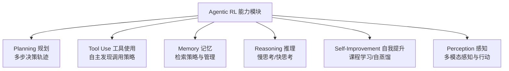
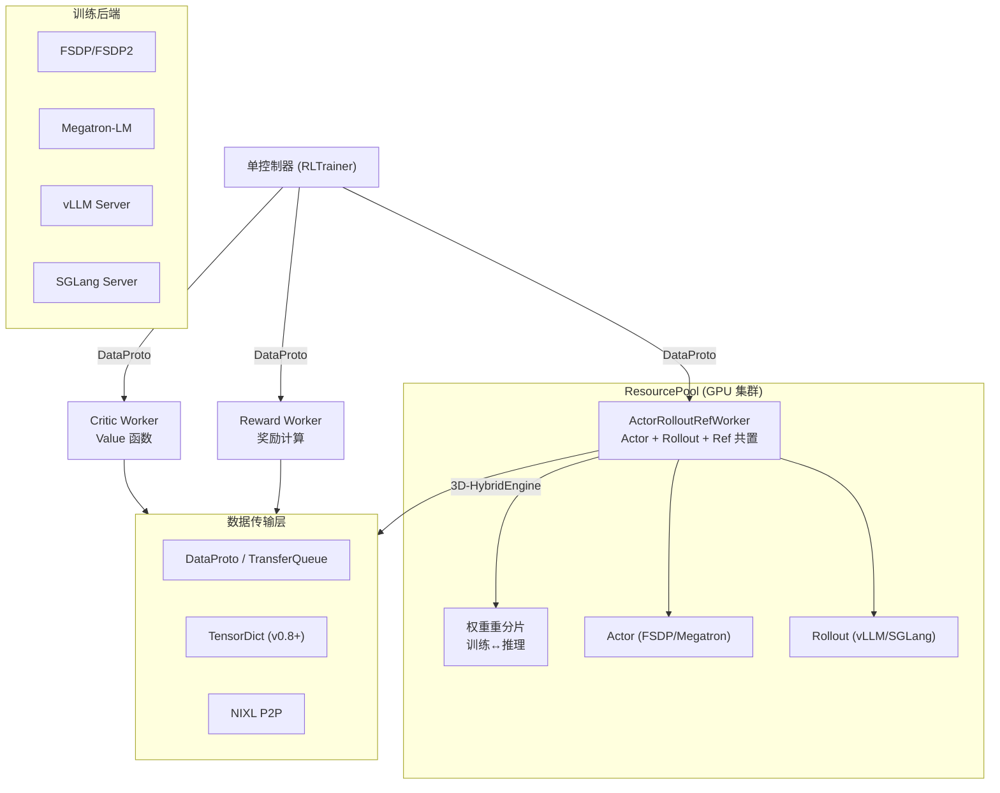
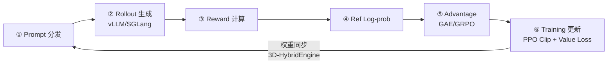
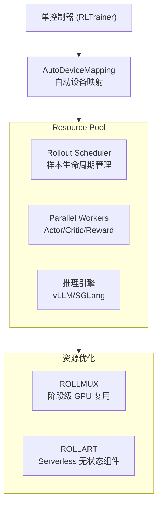
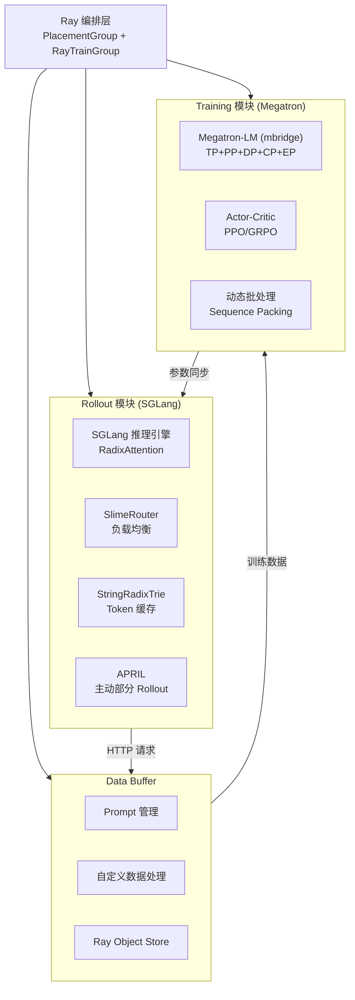
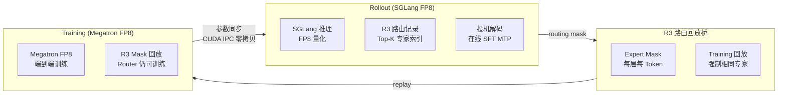
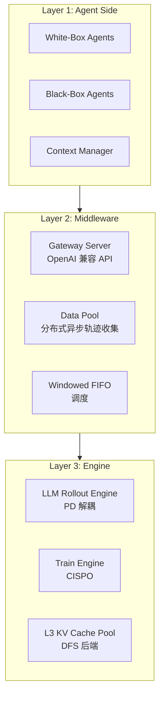

# Agentic RL 训练系统基础设施调研报告

> 日期: 2026-04-26 | 动态架构图: [diagrams/index.html](diagrams/index.html) | 快速参考: [summary-table.md](summary-table.md)

---

## 1. 引言

### 1.1 背景

大语言模型 (LLM) 的强化学习后训练 (RL Post-Training) 已成为提升模型推理、对齐和 Agent 能力的核心技术路径。从 OpenAI 的 RLHF 到 DeepSeek-R1 的 GRPO，RL 训练系统需要高效协调四个关键子系统：**Rollout 生成**、**Training 优化**、**Data Processing 数据处理**和**I/O 通信**。

随着模型规模从 7B 增长到 671B (MoE)，上下文长度从 2K 扩展到 200K，训练场景从单轮对话演进到多轮 Agent 交互，RL 训练基础设施面临前所未有的挑战：Rollout 阶段的长尾延迟、训练与推理间的权重同步开销、MoE 路由不一致性、以及 GPU 资源利用率低下等问题。

正如 Zhang et al. 在 [The Landscape of Agentic Reinforcement Learning for LLMs: A Survey](https://arxiv.org/abs/2509.02547) (TMLR 2026) 中指出，RL 正在从传统的**单步 MDP 对齐范式** (LLM RL) 向**时序扩展 POMDP 的 Agentic RL 范式**转变——LLM 不再是被动的序列生成器，而是嵌入复杂动态世界中的自主决策 Agent。这一范式转变对训练基础设施提出了全新的要求。

### 1.2 调研目标

本报告对 8 个代表性 Agentic RL 训练系统进行深度分析，重点关注：

1. **Rollout 依赖**：推理引擎选择、生成模式、长尾处理策略
2. **Training 依赖**：训练引擎、并行策略、算法实现
3. **Data Processing 依赖**：数据协议、缓冲区设计、序列优化
4. **I/O 依赖**：通信框架、权重同步、集合通信
5. **Agentic 特有挑战**：环境管理、上下文管理、Off-Policy 控制、奖励工程

### 1.3 调研项目

| 编号 | 系统 | 组织 | 来源 |
|------|------|------|------|
| 1 | verl / HybridFlow | 字节跳动 | [GitHub](https://github.com/verl-project/verl) |
| 2 | ROLL | 阿里巴巴 | [GitHub](https://github.com/alibaba/ROLL) |
| 3 | SLIME | 清华 THUDM | [GitHub](https://github.com/THUDM/slime) |
| 4 | MILES | RadixArk | [GitHub](https://github.com/radixark/miles) |
| 5 | MiniMax Forge | MiniMax | [HuggingFace Blog](https://huggingface.co/blog/MiniMax-AI/forge-scalable-agent-rl-framework-and-algorithm) |
| 6 | Seer | 月之暗面 (Moonshot AI) | [arXiv 2511.14617](https://arxiv.org/pdf/2511.14617) |
| 7 | rl-swarm | Gensyn | [GitHub](https://github.com/gensyn-ai/rl-swarm) |
| 8 | ThunderAgent | Together AI | [arXiv 2602.13692](https://arxiv.org/abs/2602.13692), [GitHub](https://github.com/ThunderAgent-org/ThunderAgent) |

---

## 2. 核心概念

### 2.1 Rollout / Generation (生成)

Rollout 阶段使用当前策略模型对输入 Prompt 进行自回归推理，生成 Response 序列。该阶段需要记录每个 Token 的采样概率 (log-probability)，用于后续策略梯度计算。Rollout 是 RL 训练流水线中最耗时的环节，在长 Chain-of-Thought (CoT) 场景下可占总时间的 63%-87%。

### 2.2 Training / Optimization (训练)

Training 阶段根据 Rollout 数据和奖励信号计算策略梯度并更新模型参数。核心算法包括 PPO (Proximal Policy Optimization)、GRPO (Group Relative Policy Optimization)、DAPO 等。训练引擎需要支持大规模分布式并行（TP/PP/DP/CP/EP）。

### 2.3 Data Processing (数据处理)

数据处理涵盖 Rollout 和 Training 之间的数据流转，包括奖励计算、Advantage 估计 (GAE)、数据分发与聚合、序列打包等。高效的数据处理需要零拷贝传输和 RDMA 支持。

### 2.4 I/O & Communication (通信)

I/O 层负责 GPU 间的集合通信 (NCCL AllReduce/AllGather)、训练与推理间的权重同步、分布式调度 (Ray) 以及推理引擎的服务通信 (gRPC/HTTP)。权重同步是连接 Rollout 和 Training 的关键瓶颈。

### 2.5 LLM RL vs. Agentic RL: 范式转变

> 参考框架: [The Landscape of Agentic RL for LLMs](https://arxiv.org/abs/2509.02547) (TMLR 2026, 综合 500+ 篇工作)

传统 LLM RL 与 Agentic RL 的核心区别在于 MDP 建模层次：

| 维度 | LLM RL (传统) | Agentic RL |
|------|-------------|-----------|
| **MDP 模型** | 退化的单步 MDP | 时序扩展 POMDP |
| **状态** | Prompt + 已生成 Token | 完整环境状态 (网页/代码/机器人位置)，部分可观 |
| **动作空间** | 词汇表 Token | Token + 工具调用 + API + GUI 操作 + 代码执行 |
| **转移动态** | 确定性 (下一 Token 拼接) | 环境介导、随机、可能对抗 |
| **奖励函数** | 偏好模型 (静态) | 任务指标、执行验证、Critique 评估 |
| **交互** | 单轮 | 多轮、多步、与外部环境持续交互 |
| **信用分配** | Token 级 | 需要跨步骤/跨轮次的长程信用分配 |

#### 2.5.1 RL 粒度: Token 级 vs. Turn 级 vs. Trajectory 级

这一设计轴对训练基础设施有直接影响：

| 粒度 | 描述 | 优势 | 劣势 | 代表系统 |
|------|------|------|------|---------|
| **Token 级** | 每个 Token = 独立 MDP 步骤 | 细粒度信用分配 | 无法捕获 Agent 行为结构 | verl (PPO), SLIME |
| **Turn 级** | 每个 Agent 轮次 = 一个 MDP 步骤 | 匹配任务结构 | 错过轮次内部动态 | Forge (Agent 多轮) |
| **Trajectory 级** | 完整轨迹获得单一奖励 | 奖励设计简单 | 信号稀疏、信用分配困难 | rl-swarm (SAPO) |
| **双层 (Bi-Level)** | 组合 Turn 级和 Token 级 | 结构对齐 + 细粒度 | 复杂度高 | 前沿研究方向 |

**关键发现**: 从传统 LLM RL 继承的 Token 级 MDP 对于 Agentic 任务日益不适用。Turn/Step 应成为 LLM Agent 的适当动作表示。

#### 2.5.2 奖励建模分类

| 类型 | 描述 | 粒度 | 代表系统 |
|------|------|------|---------|
| **Outcome-Based (ORM)** | 最终答案二元 pass/fail | Trajectory | verl, SLIME, MILES |
| **Process-Based (PRM)** | 推理步骤级反馈 | Step/Turn | Seer (context-aware) |
| **Rule-Based** | 确定性验证 (代码执行, 数学检查) | 可变 | verl (RLVR), ROLL |
| **Model-Based** | 学习的奖励模型 | 可变 | verl (RM Worker) |
| **Critique-Augmented** | LLM Critique 作为奖励一部分 | Step | Forge (Evaluator) |
| **Self-Reward** | 模型评估自身输出 | 可变 | - |
| **RLVR (可验证奖励)** | 自动验证 + 自博弈 | 可变 | 新兴主流范式 |

**趋势**: 从人类标注奖励 → 自动验证和自博弈。模块化堆栈正在形成: SFT → DPO/SimPO 对齐 → GRPO/DAPO 可验证推理。

#### 2.5.3 Agentic 能力维度

该综述将 Agent 能力映射为 6 大可 RL 优化的模块:



各调研系统对这些能力的支持程度见下文 §4.5 对比表。

#### 2.5.4 Agentic RL 基础设施挑战 (综述识别)

该综述识别了 Agentic RL 对基础设施的 5 大核心需求:

1. **变长轨迹**: 环境交互产生不可预测长度的轨迹 → 需要动态批处理 (verl Server 模式, Forge Windowed FIFO)
2. **扩展上下文窗口**: 长 CoT 推理链 → 高效 KV Cache 管理 (Seer Mooncake, Forge L3 Pool)
3. **高度可变的环境响应延迟**: 工具调用可能从毫秒到分钟 → 异步架构必需 (verl AgentLoop, ROLL 异步模式)
4. **管理数千并发环境**: 分布式调度、状态检查点、容错、可复现性 → 编排层设计 (Ray, Hivemind, ThunderAgent Program 抽象)
5. **大量外部云资源**: CPU 执行代码、GPU 运行奖励模型 → 超出主训练集群 (ROLLART Serverless)

#### 2.5.5 Agentic RL Infra 重构的三大核心挑战

> 参考: [知乎 - Agentic RL 时代的 Infra 重构](https://zhuanlan.zhihu.com/p/2022786148087464077), [attack204 综述](https://qingkeai.online/archives/26-Agentic-RL-Infra)

从传统 LLM RL 到 Agentic RL 的 Infra 演进中，3 个核心挑战尤为突出:

**挑战一: Off-Policy 与异步训练的权衡**

异步 RL 训练不可避免地引入 Off-Policy 问题。关键权衡:
- 若仅使用**最新鲜**的数据、丢弃旧版本 → 训练偏向"快而简单"的样本 (采样偏差)
- 若仅使用**最陈旧**的数据 → Rollout 长尾效应导致系统吞吐量下降

各系统的解决方案:
| 系统 | Off-Policy 控制策略 |
|------|-------------------|
| Forge | **滑动窗口算法** (Windowed FIFO): 窗口内可任意选择轨迹，但要求旧数据必须完成才能推进窗口 |
| SLIME | **双边 IS (Importance Sampling)** 采样修正偏差 |
| ROLL | **Chunked MDP** 级别的重要性采样，Chunk 级别计算 reward 和 IS |
| Seer | 严格同步 On-Policy，通过 Divided Rollout 消除气泡而非引入异步 |
| verl | 异步训练 + DataProto 版本管理 |

**挑战二: 环境管理与数据质量**

Agentic RL 的环境交互引入独特的数据质量挑战:
- **环境泄露**: Agent 训练过程中生成的中间产物 (临时文件、缓存) 可能间接提示模型，导致"作弊"——例如读取或修改测试脚本
- **伪阳性 (False Positive)**: 大量测试数据不完整或错误，导致虚假的正向奖励信号
- **No-op 通过**: 某些测试用例不执行任何有效操作就能通过

**挑战三: 上下文管理 (Context Management)**

Agent 的多轮交互产生超长上下文 (200K+ Token)，如何高效管理是关键:
- Forge: **将 Context Management 建模为 Agent Action**，显式告知模型上下文变化，使模型在训练中感知 CM 变化，更关注"状态关键 Token"
- Seer: Mooncake 两层 KV Cache (DRAM + SSD) 分布式缓存
- ThunderAgent: Program 抽象跟踪工作流阶段，防止 KV-Cache Thrashing

---

## 3. 系统逐一分析

### 3.1 verl (字节跳动)

#### 3.1.1 项目概述

verl (Volcano Engine Reinforcement Learning) 是目前最成熟的开源 LLM RL 训练框架。其核心创新 **HybridFlow** 将单控制器 (MPMD) 和多控制器 (SPMD) 编程范式统一于一个系统中，论文被 EuroSys 2025 接收。当前版本 v0.7.1 (2026年1月发布)。

#### 3.1.2 架构设计



**关键抽象：**
- **ResourcePool**: Ray placement group 管理的 GPU 集合
- **WorkerGroup**: Worker 代理，方法通过 `@register(dispatch_mode=Dispatch.DP_COMPUTE_PROTO)` 装饰器定义数据分发和收集策略
- **create_colocated_worker_cls**: 将多个角色 (Actor/Rollout/Ref) 合并为同一 Ray remote class，在同一 GPU 上时分复用

#### 3.1.3 Rollout 实现

- **推理引擎**: vLLM (主要)、SGLang (同等支持)、TensorRT-LLM (v0.8 计划)
- **v0.7 默认 Server 模式**: 推理引擎作为独立服务器进程，使用动态批处理 (Dynamic Batching)，支持 AgentLoop 多轮 Agentic 任务
- **GRPO 分发**: `repeat-chunk-dispatch` 模式 —— 在驱动端重复样本后分块分发到 Rollout Worker
- **异步生成**: 完全解耦 Trainer 和 Rollouter，实现 2.35x-2.67x 性能提升 (128 GPU, Qwen2.5-7B)

#### 3.1.4 Training 实现

- **训练引擎**: FSDP/FSDP2 (ZeRO-3, 推荐研究) + Megatron-LM (推荐生产)
- **5D 并行**: DP (数据) + TP (张量) + PP (流水线) + CP (上下文/Ring Attention) + EP (专家, MoE)
- **算法**: PPO, GRPO, GSPO, DAPO, DPO, SFT, REINFORCE++, RLOO, PRIME
- **量化**: 实验性 FP8 训练 (Megatron 后端)

#### 3.1.5 Data Processing

- **DataProto**: 张量 + 元数据的统一通信协议，`Dispatch.DP_COMPUTE_PROTO` 自动分片/分发/收集
- **TransferQueue** (v0.7 实验性): 控制流与数据流解耦，RLTrainer 仅分发指令和元数据；使用 2D 存储结构（行=训练样本, 列=I/O 字段），支持零拷贝和 RDMA
- **v0.8 路线**: 默认 TensorDict 替代 DataProto，消除 padding 传输

#### 3.1.6 I/O 与通信

| 机制 | 用途 |
|------|------|
| Ray | 单控制器编排、placement group、Actor 管理 |
| NCCL | 模型内集合通信、权重同步广播，<300ms 延迟 |
| NIXL | P2P 点对点通信，GPU-Direct RDMA，不占用 GPU SM |
| 3D-HybridEngine | 训练↔推理权重重分片：PP 维度转为 micro-DP |
| Checkpoint Engine | 统一权重同步抽象，NCCL/NIXL 后端可选 |

#### 3.1.7 训练流程



#### 3.1.8 性能数据

| 指标 | 数值 | 条件 |
|------|------|------|
| vs DeepSpeed-Chat | 3.67x+ | 原始基准 (EuroSys 2025) |
| 异步训练加速 | 2.35-2.67x | 128 GPU, Qwen2.5-7B |
| vs SOTA baselines | 1.53x | 128 A100, 多算法 |
| DAPO on AIME 2024 | 50 分 | Qwen2.5-32B |
| 最大模型 | 671B MoE | DeepSeek |
| 万亿参数 LoRA | 64 H800 | Mind Lab, 2025.12 |

---

### 3.2 ROLL (阿里巴巴)

#### 3.2.1 项目概述

ROLL 是阿里巴巴开发的高效可扩展 RL 训练库，核心特色是 **AutoDeviceMapping** 灵活设备映射和 **ROLLMUX/ROLLART** 资源优化系统。支持共置、解耦和 Serverless 三种部署模式的灵活切换。

#### 3.2.2 架构设计



#### 3.2.3 Rollout 实现

- **Rollout Scheduler**: 管理每个 Prompt 样本的完整生命周期 (add_request / abort_request)
- **4 种 Rollout 模式**: 同步、样本级异步、环境级异步、完全异步解耦
- **RollPacker**: 尾部批处理 + 投机执行，2.03-2.56x 加速 (vs verl)
- **动态 FP8 Rollout**: vLLM 后端支持

#### 3.2.4 Training 实现

- DeepSpeed ZeRO + Megatron 5D 并行 + LoRA
- 10+ RL 算法，支持 RLVR/Agentic/Distill/DPO/SFT 流水线
- ROLL Flash: 异步训练加速
- AMD GPU 支持 (ROCm)

#### 3.2.5 Agentic RL 特有机制

##### Chunked MDP

ROLL 提出 **Chunked MDP** 概念: 将两次环境交互之间的连续段称为一个 "Chunk"，在 Chunk 级别计算奖励和重要性采样 (IS)。这介于 GRPO (Token 级 IS) 和 GSPO (序列级 IS) 之间，更好地匹配 Agent 的交互结构。

##### AgentServer

ROLL 引入独立的 **AgentServer** 作为中间层:
```
原始: RLFramework(Verl/Slime) -> RolloutEngine => [AsyncBuffer] -> Trainer
新增: RLFramework(Verl/Slime) -> [AgentServer <-> RolloutEngine] => [AsyncBuffer] -> Trainer
```
- 使用 **Rock** 作为沙箱环境 (Sandbox)
- **iFlow CLI** 管理 Agent-Model 交互
- AgentServer 负责环境生命周期管理

##### 环境管理与防泄露

Agentic RL 训练中 Agent 经常留下中间产物 (如临时文件)，可能间接向模型提供 hint，导致"作弊"——例如读取或修改测试脚本。ROLL 的应对:
- **严格环境清理**: Rollout 前主动清理环境初始化或 Agent 安装过程中生成的中间文件
- **测试文件隔离**: 测试文件仅在最终评估阶段上传，严格与训练阶段隔离
- **防止资源泄露和环境污染**

##### 数据质量保障

- **LLM-as-Judge 验证**: 发现大量测试数据存在伪阳性 (false positive) 问题后，引入多 LLM 交叉验证模块，只有通过验证的实例才能进入 RL 训练池
- **No-op 验证**: 如果某测试用例不执行任何有效操作即可通过，该实例会被直接丢弃

##### Dense Reward 机制

ROLL 为 Agentic 场景设计了多种 Dense Reward:
- **过程奖励 (Process Reward)**: 中间步骤级反馈
- **任务完成时间奖励**: 鼓励模型选择高效执行路径
- **Reward-to-Go**: 归一化长期收益，改善长时序任务的信用分配

#### 3.2.5 Data Processing

- **AutoDeviceMapping**: 编排 CPU/GPU 资源池，灵活绑定 Workers 和 Scheduler
- **ROLLMUX 轻量挂起**: 数据面状态 offload 到主机内存后释放 GPU，恢复时仅需 reload 缓存状态，避免冷启动
- **ROLLART**: 无状态组件 (如 Reward Model) offload 到 Serverless 函数计算，零开销弹性伸缩

#### 3.2.6 I/O 与通信

- **ROLLMUX**: 控制面/数据面解耦，分层 2 阶段权重同步 (7.87-8.33x faster than verl)
- **ROLLART**: Python 装饰器定义硬件亲和性，分布式运行时编排异步 trajectory 级工作流
- Ray 调度、NCCL 通信、gRPC/HTTP 推理

#### 3.2.7 性能数据

| 指标 | 数值 | 条件 |
|------|------|------|
| ROLLMUX 成本效率 | 1.84x | vs 标准解耦 |
| ROLLMUX vs 共置 | 1.38x | 成本效率 |
| SLO 达成率 | 100% | ROLLMUX |
| ROLLART 加速 | 1.35-2.05x | 3000+ GPU 验证 |
| RollPacker | 2.03-2.56x | vs verl |
| 权重同步 | 7.87-8.33x | vs verl |

---

### 3.3 SLIME (清华 THUDM)

#### 3.3.1 项目概述

SLIME 是清华大学 THUDM 团队开发的 LLM RL Scaling 后训练框架，以 **SGLang 原生设计**为核心，训练端采用 Megatron-LM。是 GLM-4.5 / GLM-5 的生产训练框架，唯一经验证可训练 355B MoE 模型的开源 RL 框架。当前版本 v0.2.3。

#### 3.3.2 架构设计



#### 3.3.3 Rollout 实现

- **SGLang 原生集成**: 非通用推理后端接入，而是围绕 SGLang 的特性深度优化
- **SlimeRouter (sgl-router)**: 多 SGLang 实例间的智能负载均衡，暴露单一 HTTP 端点和 OpenAI 兼容 API，使外部 Agent 系统可直接与 SGLang 交互——**用户无需为 RL 框架更改 Agent 环境**
- **Agent 框架与 RL 框架解耦**: Slime 的核心设计优势——通过 sgl-router 地址暴露，让外部 Agent 系统直接与推理引擎互动
- **StringRadixTrie**: Token 级前缀缓存，加速共享前缀的多次采样，保证多轮对话 logits 的准确性
- **APRIL (Active Partial Rollouts in RL)**: 过量供应 Rollout 请求 → 达到目标数量后主动停止未完成的 → 智能回收部分结果用于未来迭代。49.5% Rollout 吞吐量提升，40% 端到端吞吐量提升 (9.3k → 13k tokens/s)
- **FP8 + DeepEP**: 在 GLM4.5-355B 上实现 6-7x 推理加速
- **多轮模式**: 支持单轮和多轮 RL 训练，多轮模式在代码生成任务上表现一致更好

#### 3.3.4 Training 实现

- Megatron-LM (via mbridge): 完整 TP+PP+DP+CP+EP 并行
- PPO / GRPO / DAPO / GSPO 算法
- 同步 + 异步双模式: 共置模式 (共享 GPU, 交替执行) 和异步模式 (分区 GPU, 持续流式处理, 安全抢占进行中请求)
- **双边 IS (Importance Sampling) 采样修正**: 异步模式下通过双边重要性采样修正 Off-Policy 偏差
- AMD Instinct GPU 支持 (ROCm), 40% 吞吐量提升已在 AMD GPU 上验证

#### 3.3.5 Agentic 生态: OpenClaw-RL

**OpenClaw-RL** (Gen-Verse, arXiv 2026) 基于 Slime 构建，将 Agentic RL 推向全异步:
- **完全异步解耦**: Agent 服务、Rollout 收集、PRM/Judge 评估、策略训练各自独立异步运行，互不阻塞
- 将模型封装为 OpenAI 兼容 API，截获实时多轮对话，后台持续优化策略
- 集成 Slime 进行工具调用 RL 训练
- 使用 SETA 数据集和 Agent 框架构建终端 RL

#### 3.3.5 Data Processing

- **Data Buffer**: 桥接模块，管理 Prompt 初始化、自定义数据处理和 Rollout 生成方法注册
- **Ray Object Store**: 中间结果存储
- **Advantage Estimator**: 可插拔的 PPO/GRPO 估计器

#### 3.3.6 I/O 与通信

| 机制 | 用途 |
|------|------|
| Ray | PlacementGroup 资源分配 + RayTrainGroup Actor 管理 |
| HTTP | Rollout ↔ SGLang Server 通信 |
| UpdateWeightFromTensor | 共置模式: CUDA IPC 零拷贝内存映射 |
| UpdateWeightFromDistributed | 分布式模式: NVLink/InfiniBand 传输 |
| NCCL | 训练内集合通信 |

权重同步: BF16 约 48 秒，FP8 约 100 秒。

#### 3.3.7 性能数据

| 指标 | 数值 |
|------|------|
| 最大验证规模 | GLM-4.5-355B-A32B (64×H100) |
| DeepSeek-R1 | 128×H100 |
| APRIL 端到端加速 | 40% 吞吐量提升 |
| APRIL Rollout 加速 | 49.5% |
| FP8+DeepEP 推理 | 6-7x (GLM4.5-355B) |
| 精度提升 | 最高 12.8% |

---

### 3.4 MILES (RadixArk)

#### 3.4.1 项目概述

MILES 是 SLIME 的企业级分支，由 InfiXAI、蚂蚁集团和 SGLang RL Team 联合开发。核心解决 SGLang 与 Megatron **MoE 路由不一致**问题：实证发现约 10% 的 Router 在两个引擎间选择不同专家，94% 的 Token 至少在一层选择了不同专家。

#### 3.4.2 架构设计



#### 3.4.3 核心创新: R3 (Rollout Routing Replay)

1. Rollout 阶段 (SGLang): 记录每层每 Token 的 Top-K 专家索引
2. Training 阶段 (Megatron): 回放这些路由决策，在 softmax 门控中强制激活相同专家
3. Router 权重仍然可训练 —— 只是强制选择与 Rollout 一致的专家
4. 结果: 高差异 Token 数量级降低，KL 散度大幅下降

#### 3.4.4 端到端 FP8

- 首个同时在 Rollout 和 Training 中使用 FP8 的框架
- 核心洞见: 仅 Rollout FP8 (Training 保持 BF16) 比端到端 FP8 不一致性更差
- FP16 的 10-bit 尾数比 BF16 的 7-bit 更鲁棒
- INT4 QAT (W4A16): 1TB 模型可在单机 H200 上推理，2x Rollout 效率

#### 3.4.5 其他特性

- **投机解码**: 在线 SFT MTP 草稿层，草稿模型与训练同步更新，25%+ Rollout 加速
- **MrlX**: 异步共演化多智能体 RL 框架
- **权重同步**: CUDA IPC 零拷贝映射，异步张量收集，50% 同步时间降低

---

### 3.5 MiniMax Forge

#### 3.5.1 项目概述

Forge 是 MiniMax 开发的 Agent RL 框架，用于训练 MiniMax M2.5 (230B 总参数, 10B 活跃 MoE)。采用**三层中间件架构**解决 Agent RL 的"不可能三角"：吞吐量 vs 稳定性 vs 灵活性。

#### 3.5.2 三层架构



#### 3.5.3 CISPO 算法

**Clipped Importance Sampling Policy Optimization** —— 与 PPO 的核心区别：

- **PPO**: 裁剪策略比率 (token 级)，系统性过滤某些 Token（如语气词"wait"），这些 Token 永远不接收梯度
- **CISPO**: 裁剪重要性采样权重，确保**所有 Token 参与梯度计算**
- 引入一定偏差但显著降低方差
- 结果: 在 Qwen2.5-32B 上比 DAPO 快 **2x**，更高收敛上限

#### 3.5.4 Prefix Tree Merging

- 共享公共 Prompt 前缀的多个 Completion 合并为单棵前缀树
- 使用 **Magi Attention** 保证逻辑等价性
- 前向传播后通过元数据解构前缀树计算损失
- 结果: **~40x 训练加速**，内存开销降低

#### 3.5.5 Context Management 建模

Forge 在 Agentic RL 中的一个关键创新是将 **Context Management (CM) 建模为 Agent Action**:
- 在训练中显式地告知模型上下文的变化情况
- 让模型在训练阶段就能感知到 CM 的变化
- 使模型更关注 **"状态关键 Token" (state-critical tokens)**——当上下文发生变化时，这些 Token 携带的信息更为重要
- 这一设计使得 Forge 训练出的模型在部署时能更好地适应上下文窗口限制

#### 3.5.6 Off-Policy 控制: 滑动窗口算法

异步训练不可避免产生 Off-Policy 数据。Forge 的解决方案:
- **Windowed FIFO 滑动窗口**: 窗口内可任意选择轨迹用于训练，但要求旧数据必须完成后才能推进窗口
- 权衡: 若只用最新数据则偏向"快而简单"样本 (采样偏差)；若只用最旧数据则长尾效应拖累吞吐
- 滑动窗口在两者之间取得平衡

#### 3.5.7 Rollout 与推理加速

- **PD 解耦**: 异构 Prefill-Decode 分离，独立并行策略，消除 MoE dispatch 干扰
- **Dynamic MTP**: 使用 **Top-K KL Loss** 维持高草稿模型接受率的动态多 Token 预测
- **全局 L3 KV Cache Pool**: DFS 后端，成本感知调度（权衡队列延迟 vs 缓存迁移成本），针对 Agent 多轮场景的高共享前缀率最大化缓存局部性，避免过载单个实例
- **上下文**: 支持 200K Token
- **数据**: 数百种 Agent 脚手架，数千种工具格式

---

### 3.6 Seer (月之暗面)

#### 3.6.1 项目概述

Seer 是 Moonshot AI (月之暗面) 与清华大学合作开发的 RL 训练系统 (arXiv 2511.14617)。核心洞见：在长 CoT 推理场景下，Rollout 占迭代时间的 63%-87%。Seer **不改变训练算法**（仍然严格同步 On-Policy），仅通过 Divided Rollout 消除气泡。

#### 3.6.2 Divided Rollout

传统同步 Rollout 将整个 GRPO 组分配给单个推理实例。Seer 将其分解：

1. **细粒度分解**: Group 拆分为更小的 chunk (每个 chunk 8K 长度)，增量调度
2. **早期打包**: 大量短请求打包以充分利用 VRAM
3. **晚期调整**: 根据 KV Cache 预算调整并发度
4. **Context-Aware 调度**: 使用投机请求估计剩余工作量，近似最优最长优先调度
5. **KV Cache 迁移**: chunk 级调度 + Mooncake KV Cache 存储，迁移时无需重新 Prefill

#### 3.6.3 DGDS (Distributed Grouped Draft Server)

DGDS 是分布式分组草稿服务器（非"Dynamic GPU Distribution Strategy"）：

1. 为每个 GRPO 组维护**压缩后缀树 (CST)**，聚合组内所有请求的 Token 序列
2. 创建高度准确的动态"草稿模型"，与目标模型内在同步——无需独立草稿模型
3. **Marginal-Benefit-Aware Adaptive Speculation**: 平衡吞吐量与高优先级请求延迟
4. 实例异步追加生成的 Token 到 DGDS，定期获取更新的后缀树进行本地投机解码
5. 根据模型架构 (Dense vs MoE)、批大小和测量的接受长度自动调整草稿深度
6. 在长尾阶段并发度低时，增加草稿深度并启用多路径草稿以提高每步接受 Token 数

#### 3.6.4 Agentic 奖励设计

Seer 在 Agentic 场景下引入了更精细的奖励信号:
- **任务完成时间奖励**: 将任务完成时间作为奖励信号，鼓励 Agent 利用并行策略、选择最短执行路径
- **Reward-to-Go**: 归一化长时序任务的收益，显著改善信用分配精度和优化稳定性

#### 3.6.5 关键技术

- **Mooncake KVCache**: 两层 DRAM + SSD 分布式缓存，FAST 2025 最佳论文，日处理 100B+ Token
- **KV Cache 迁移**: 全局 KVCache Pool 支持请求迁移无需重计算 Prefill
- **Moonshot Checkpoint Engine**: 快速权重同步

#### 3.6.6 性能数据

在 32 节点 × 8 H800 GPU (256 GPU) 上评估：

| 指标 | 提升 |
|------|------|
| 端到端 Rollout 吞吐量 | +74% 到 +97% |
| 长尾延迟降低 | -75% 到 -93% |

**消融分析** (各组件贡献):

| 组件 | 性能贡献 |
|------|---------|
| Divided Rollout (基础) | +27% 到 +35% (动态负载均衡) |
| Context-Aware Scheduling | +6% 到 +13% (利用长度信息) |
| Adaptive Grouped Speculative Decoding | +30% 到 +44% (最大单组件贡献) |

---

### 3.7 rl-swarm (Gensyn)

#### 3.7.1 项目概述

rl-swarm 是唯一的**完全去中心化 RL 训练系统**。无需数据中心，消费级 GPU (RTX 3090+) 通过 P2P 网络协作训练。任何人可加入。

#### 3.7.2 SAPO 算法 (Swarm sAmpling Policy Optimization)

核心创新: 共享 **Rollout (文本)** 而非梯度。

1. 每个节点本地生成 Rollout (采样 + 解码)
2. 通过 Gossip 协议共享 Rollout 文本 + 元数据 + 正确答案
3. 本地计算奖励，通过 GRPO 更新策略
4. 接收其他节点的 Rollout，过滤/子采样后融入本地训练

**为什么有效**: Rollout 是架构无关的（只是文本），不同架构和规模的模型可共享经验。"Aha moments" 通过 Swarm 传播。

#### 3.7.3 通信与基础设施

| 层 | 技术 |
|---|---|
| P2P Gossip | Hivemind 协议：交换 Rollout、反馈、批评 |
| 梯度聚合 | NoLoCo: 低通信 Gossip 替代 AllReduce |
| 链上协调 | Gensyn Testnet 智能合约 |
| 训练框架 | GenRL: DataManager + RewardManager + Trainer + GameManager |

#### 3.7.4 性能数据

- 8x Qwen2.5-0.5B: 最高 94% 累计奖励提升
- 数千社区成员参与开放测试
- 局限: 高能力模型 (Qwen3 0.6B+) 收益递减，主要验证小模型 (0.5B-1.5B)

---

### 3.8 ThunderAgent (Together AI)

#### 3.8.1 项目概述

ThunderAgent 是 Together AI 开发的**程序感知 (Program-Aware) Agentic 推理系统** (arXiv 2602.13692, 2026年2月)。它解决了一个被其他系统忽视的关键问题: 当 Agentic 工作流同时涉及 GPU 推理 (Reasoning 阶段) 和 CPU 工具执行 (Acting 阶段) 时，传统推理引擎的请求级调度导致严重的 **KV-Cache Thrashing**。

#### 3.8.2 核心问题: KV-Cache Thrashing

传统请求感知引擎 (如 vLLM) 在 Agentic 场景下的瓶颈:
- Agent 工作流由 **Reasoning 阶段** (消耗 GPU) 和 **Acting 阶段** (工具调用, 不消耗 GPU) 交替组成
- Acting 阶段中，引擎将该工作流的 KV Cache 视为可驱逐的空闲内存
- 高并发下，几乎所有 GPU 内存被工作流 KV Cache 占满
- 工具调用返回时，必要上下文需要**重新计算**，延迟膨胀高达 **7.1x**

#### 3.8.3 Program 抽象

ThunderAgent 将调度的抽象单元从"请求"提升到 **"Agentic Program"**:
- Program 是跨多次模型调用和工具执行的**持久调度单元**
- 跟踪元数据: 工作流标识符、执行阶段 (reasoning/acting)、调度状态、总 Token 数、工具资源
- 将调度与执行后端 (vLLM/SGLang) 解耦，新工作流可无缝集成

#### 3.8.4 Program-Aware 调度器

1. **KV Cache 感知调度**: 最大化 KV Cache 命中率，防止驱逐活跃工作流
2. **内存负载均衡**: 避免跨节点的内存不均
3. **异步环境准备**: 工具调用期间提前准备下一阶段的推理环境

#### 3.8.5 与 RL 训练的集成

ThunderAgent 可与现有 RL 训练框架 (如 Slime, SkyRL) 集成:
- 替代 vLLM/SGLang 作为 Rollout 引擎
- 在 Agent RL Rollout 场景下提供 1.8-3.9x 吞吐量提升
- 支持 mini-SWEAgent 和 OpenHands 等 Agentic 工作流

#### 3.8.6 性能数据

在 2 × 8×H100 节点上评估:

| 指标 | 数值 | 条件 |
|------|------|------|
| 推理服务吞吐量 | 1.5-3.6x | vs vLLM/Continuum |
| RL Rollout 吞吐量 | 1.8-3.9x | vs vLLM + SGLang Gateway |
| 磁盘内存节省 | 最高 4.2x | |
| KV Cache Thrashing 消除 | 7.1x 延迟膨胀→近零 | |

---

## 4. 横向对比分析

### 4.1 Rollout 对比

| 系统 | 推理引擎 | 推理模式 | 投机解码 | 长尾处理 |
|------|---------|---------|---------|---------|
| verl | vLLM/SGLang/TRT-LLM | Server 模式 | - | AgentLoop |
| ROLL | vLLM/SGLang | 动态 FP8 | - | Scheduler+RollPacker |
| SLIME | SGLang | HTTP Server | - | APRIL |
| MILES | SGLang (FP8) | HTTP Server | 在线 SFT MTP (25%+) | APRIL + 过采样 |
| Forge | 自研 | PD 解耦 | Dynamic MTP | Windowed FIFO |
| Seer | vLLM | Divided Rollout | DGDS | 分段消除气泡 |
| rl-swarm | vLLM/本地 | 本地推理 | - | - |
| ThunderAgent | vLLM/SGLang | Program-Aware | - | KV-Cache 感知调度 |

### 4.2 Training 对比

| 系统 | 训练引擎 | 并行策略 | 核心算法 | 量化 |
|------|---------|---------|---------|------|
| verl | FSDP/Megatron | 5D | PPO/GRPO/DAPO | 实验 FP8 |
| ROLL | Megatron/FSDP/DS | 自动选择 | PPO/GRPO/DAPO | FP8 Rollout |
| SLIME | Megatron (mbridge) | 5D | PPO/GRPO/DAPO | - |
| MILES | Megatron (mbridge) | TP+PP+DP+EP | GRPO+TIS/MIS | FP8 E2E/INT4 |
| Forge | 自研 (Magi) | 自研 | CISPO | - |
| Seer | Megatron | DP+TP | PPO/GRPO | - |
| rl-swarm | trl+Hivemind | P2P AllReduce | SAPO | - |
| ThunderAgent | 依赖集成框架 | 依赖集成框架 | 依赖集成框架 | - |

### 4.3 I/O 与通信对比

| 系统 | 调度 | 集合通信 | 权重同步方案 | 同步性能 |
|------|------|---------|------------|---------|
| verl | Ray | NCCL | 3D-HybridEngine/NIXL | <300ms |
| ROLL | Ray | NCCL | ROLLMUX 挂起/恢复 | 7.87-8.33x vs verl |
| SLIME | Ray | NCCL | CUDA IPC/分布式 | BF16~48s |
| MILES | Ray | NCCL | CUDA IPC 零拷贝 | 50%↓ |
| Forge | 自研 | 自研 | L3 KV Cache Pool | - |
| Seer | 自研 | NCCL | Mooncake Checkpoint | - |
| rl-swarm | Hivemind | P2P | Gossip 广播 | 高延迟 |
| ThunderAgent | Program-Aware | 依赖后端 | 依赖后端 | 1.8-3.9x Rollout |

### 4.4 创新点对比

| 系统 | 核心创新 | 解决的问题 |
|------|---------|-----------|
| verl | HybridFlow + 3D-HybridEngine | 灵活性与性能统一 |
| ROLL | ROLLMUX 阶段复用 + ROLLART Serverless + Chunked MDP | GPU 利用率 + Agentic 奖励建模 |
| SLIME | APRIL + SGLang 原生 + Agent-RL 解耦 | 长尾延迟 + Agent 生态兼容 |
| MILES | R3 路由回放 + 端到端 FP8 | MoE 训练-推理一致性 |
| Forge | CISPO + Prefix Tree + CM as Action | 全 Token 梯度 + 40x 训练加速 + 上下文感知 |
| Seer | Divided Rollout + DGDS + 时间奖励 | 长 CoT 气泡消除 + Agentic 奖励 |
| rl-swarm | SAPO P2P 训练 | 去中心化民主化 |
| ThunderAgent | Program 抽象 + KV-Cache 感知 | KV-Cache Thrashing 消除 |

### 4.5 Agentic RL 特有挑战对比 (新增)

> 此维度聚焦从传统 LLM RL 到 Agentic RL 的 Infra 重构关键点

#### 4.5.0 环境管理与数据质量

| 维度 | verl | ROLL | SLIME | MILES | Forge | Seer | rl-swarm | ThunderAgent |
|------|------|------|-------|-------|-------|------|----------|-------------|
| **环境沙箱** | - | Rock Sandbox + iFlow | - | - | 多Agent脚手架 | - | 本地沙箱 | Docker容器 |
| **环境泄露防护** | - | ✅ 严格清理+隔离 | - | - | Gateway隔离 | - | - | Program隔离 |
| **数据质量验证** | - | LLM-as-Judge + No-op | - | - | Evaluator | - | 交叉评估 | - |
| **伪阳性处理** | - | ✅ 多LLM交叉验证 | - | - | 部分 | - | - | - |

#### 4.5.0b Off-Policy 控制策略

| 系统 | Off-Policy 策略 | MDP 粒度 | IS 校正 |
|------|----------------|---------|---------|
| verl | 异步 + 版本管理 | Token/Trajectory | PPO Clip |
| ROLL | 异步 + Chunked MDP | **Chunk 级** (环境交互间隔) | Chunk 级 IS |
| SLIME | 异步 + 双边 IS | Token/Trajectory | 双边 IS 修正 |
| MILES | 异步 + GRPO 变体 | Token/Trajectory | TIS/MIS |
| Forge | **滑动窗口** (Windowed FIFO) | Turn 级 | CISPO IS 裁剪 |
| Seer | **严格同步 On-Policy** | Token/Trajectory | 无需 (同步) |
| rl-swarm | Gossip 异步 | Trajectory | - |
| ThunderAgent | 依赖集成框架 | 依赖集成框架 | 依赖集成框架 |

#### 4.5.0c 上下文管理 (Context Management)

| 系统 | 策略 | 最大上下文 | KV Cache 管理 |
|------|------|----------|-------------|
| verl | 动态批处理 | - | vLLM/SGLang 内置 |
| ROLL | Scheduler 管理 | - | vLLM/SGLang 内置 |
| SLIME | RadixTrie 前缀缓存 | - | SGLang RadixAttention |
| MILES | RadixTrie 前缀缓存 | - | SGLang RadixAttention |
| Forge | **CM as Agent Action** | 200K | 全局 L3 KV Cache Pool (DFS) |
| Seer | Mooncake 分布式 | 长CoT | 两层 DRAM+SSD, 迁移无需重Prefill |
| rl-swarm | 本地管理 | - | 本地 |
| ThunderAgent | **Program 感知** | - | 防止 KV-Cache Thrashing, 7.1x 优化 |

### 4.5 Agentic 维度对比 (基于综述框架)

> 以下对比维度参考 [The Landscape of Agentic RL for LLMs](https://arxiv.org/abs/2509.02547) 的分类体系

#### 4.5.1 RL 粒度与 MDP 建模

| 系统 | MDP 类型 | RL 粒度 | 多轮支持 | 环境交互 |
|------|---------|---------|---------|---------|
| verl | 单步→POMDP演进中 | Token 级 (PPO) / Trajectory 级 (GRPO) | AgentLoop (v0.7) | vLLM/SGLang Server |
| ROLL | 单步→POMDP | Token/Turn/Trajectory/**Chunk** 灵活 | 4 种异步模式 + AgentServer | 环境级异步 + Rock Sandbox |
| SLIME | 单步 MDP 为主 | Token/Trajectory | 多轮模式 (代码生成更优) | HTTP API + sgl-router |
| MILES | 单步 MDP 为主 | Token/Trajectory | MrlX 多智能体 | HTTP API |
| Forge | POMDP (原生 Agentic) | Turn 级 (多轮 Agent) | 原生多轮 | Gateway + 环境 |
| Seer | 单步 MDP | Token/Trajectory | - | 内部 RPC |
| rl-swarm | POMDP (CodeZero) | Trajectory 级 | 多轮代码任务 | 本地沙箱 |
| ThunderAgent | 依赖集成框架 | 依赖集成框架 | Program 级多轮 | Program-Aware 调度 |

#### 4.5.2 奖励建模方式

| 系统 | 奖励类型 | 奖励粒度 | 可验证奖励 (RLVR) | Critic 模型 |
|------|---------|---------|------------------|-----------|
| verl | ORM + Rule + Model | Trajectory | ✅ 支持 | ✅ PPO Critic |
| ROLL | ORM + Rule + Model + **Dense** | Trajectory/Step/**Chunk** | ✅ 支持 | ✅ |
| SLIME | ORM + Rule + Verifier | Trajectory | ✅ 支持 | ✅ PPO |
| MILES | ORM + Rule | Trajectory | ✅ 支持 | ❌ GRPO (无 Critic) |
| Forge | Model + Critique | Turn 级 | 部分 | ❌ CISPO (无 Critic) |
| Seer | ORM + Rule + **时间奖励** | Trajectory + **Reward-to-Go** | ✅ 支持 | ✅ PPO |
| rl-swarm | Model-Based (Evaluator) | Trajectory | 部分 (CodeZero) | ❌ SAPO (无 Critic) |
| ThunderAgent | 依赖集成框架 | 依赖集成框架 | 依赖集成框架 | 依赖集成框架 |

#### 4.5.3 Agentic 能力支持度

| 能力 | verl | ROLL | SLIME | MILES | Forge | Seer | rl-swarm | ThunderAgent |
|------|------|------|-------|-------|-------|------|----------|-------------|
| **Planning** | AgentLoop | 异步流水线 | - | - | Gateway 编排 | Divided Rollout | GameManager | Program DAG |
| **Tool Use** | Server API | 环境级异步+AgentServer | HTTP+sgl-router | HTTP 调用 | 数千种工具 | 内部工具 | 代码执行 | Docker容器 |
| **Memory** | - | - | StringRadixTrie | StringRadixTrie | KV Cache Pool | Mooncake | - | KV Cache 感知 |
| **Reasoning** | GRPO/DAPO | GRPO/DAPO+Chunked | GRPO/DAPO | R3+GRPO | CISPO | DGDS 投机 | SAPO | 依赖后端 |
| **Self-Improve** | 异步迭代 | ROLL Flash | 异步训练 | 在线 SFT MTP | 混合域训练 | - | Swarm 传播 | - |
| **Multi-Agent** | - | - | OpenClaw-RL | MrlX | 多 Agent 脚手架 | - | P2P Swarm | Multi-Program |
| **Env Mgmt** | - | ✅ Rock+清理+验证 | 解耦设计 | - | Gateway隔离 | - | 本地沙箱 | Program隔离 |

#### 4.5.4 RL 算法族谱映射

基于综述的算法分类，各系统的算法定位:

```
PPO 族 (需要 Critic):
  ├── PPO-Clip ←── verl, ROLL, SLIME, Seer
  ├── PPO-KL  ←── verl
  └── Turn-PPO (Turn级) ←── 前沿研究

GRPO 族 (无 Critic, 组内相对):
  ├── GRPO ←── verl, ROLL, SLIME, MILES, Seer
  ├── DAPO (解耦Clip+动态采样) ←── verl, ROLL, SLIME
  ├── GRPO+TIS/MIS (离策略校正) ←── MILES
  └── GSPO ←── verl, SLIME

自研变体:
  ├── CISPO (裁剪重要性采样) ←── Forge
  └── SAPO (Swarm 采样) ←── rl-swarm

DPO 族 (无 RL 循环):
  └── DPO/SimPO/KTO ←── verl (支持但非主力)
```

**综述关键发现**: GRPO 通过消除 Critic 模型，减少了约 50% 的内存和计算开销，性能匹敌或超越 PPO。DAPO 进一步解决了 GRPO 在长 CoT 场景下的熵坍塌和训练不稳定问题。

---

## 5. 架构模式分类

### 5.1 控制器模式光谱

```
集中式 ←─────────────────────────────────→ 去中心化

 verl      Seer      ROLL     SLIME    MILES    Forge   ThunderAgent  rl-swarm
  │         │         │        │        │        │         │            │
单控制器  集中式    灵活      编排层   编排层   中间件   Program感知    P2P
共置     动态切换  3种模式    解耦     模块化   完全解耦 工作流级      无中心
```

### 5.2 耦合程度演进

- **紧耦合共置**: verl (默认) —— Actor/Rollout/Ref 同 GPU，3D-HybridEngine 权重切换
- **灵活切换**: ROLL —— 共置/解耦/Serverless 三模式，AutoDeviceMapping 自动选择
- **解耦设计**: SLIME, MILES —— SGLang 和 Megatron 独立进程，HTTP 通信
- **完全解耦**: Forge —— 三层中间件，Gateway 隔离 Agent 与模型
- **工作流级解耦**: ThunderAgent —— Program 抽象，调度与执行后端完全解耦
- **去中心化**: rl-swarm —— P2P 网络，无中心协调

### 5.3 趋势观察

1. **从共置到解耦**: 早期系统倾向共置以减少通信，新系统普遍采用解耦架构以获得更好的弹性和容错
2. **推理引擎标准化**: vLLM 和 SGLang 成为事实标准，Server 模式成为默认
3. **量化加速**: FP8 从实验走向生产，INT4 QAT 开始探索
4. **异步训练**: 从严格同步 On-Policy 向异步流水线演进，Off-Policy 偏差控制成为新研究热点 (滑动窗口、双边 IS、Chunked MDP)
5. **MoE 优化**: R3 路由回放、FP8 精度一致性等 MoE 专项优化
6. **Agentic 环境管理**: 环境泄露防护、数据质量验证 (LLM-as-Judge) 成为 Agentic RL 的必备组件
7. **上下文管理进化**: 从被动 KV Cache 管理到主动 Context Management (CM as Action)、Program-Aware 调度
8. **Agent-RL 解耦**: Agent 框架与 RL 框架的解耦成为趋势 (Slime sgl-router、Forge Gateway、ThunderAgent Program)

---

## 6. 结论与启示

### 6.1 核心发现: 从 LLM RL 到 Agentic RL 的基础设施演进

综合本报告的 8 个系统分析和 [Agentic RL 综述](https://arxiv.org/abs/2509.02547) 的理论框架，我们识别出基础设施演进的核心趋势：

**RLHF 时代** (2023-2024): 单步 MDP，同步批处理 Rollout，80-90% 时间花在样本生成上。TRL/DeepSpeed-Chat 的短序列设计。
**RL Scaling 时代** (2025): 异构调度 (verl, OpenRLHF)，长 CoT 推理，模型规模扩展到 671B MoE。
**Agentic RL 时代** (2025-2026): POMDP，异步多轮交互，变长轨迹，环境延迟不可预测，信用分配跨越多个步骤和轮次。Forge 异步 Data Pool、SLIME 双边 IS 采样修正偏差等创新涌现。

这一转变直接驱动了所有 8 个系统的核心设计选择：

| 基础设施需求 (综述识别) | 解决方案 (本报告系统) |
|----------------------|---------------------|
| 变长轨迹 | verl Server 模式 (动态批处理), Forge Windowed FIFO |
| 扩展上下文窗口 | Seer Mooncake (两层 KV Cache), Forge L3 Pool (200K), ThunderAgent (防 KV Thrashing) |
| 可变环境响应延迟 | verl AgentLoop (异步), ROLL 4 种异步模式, Forge Gateway, ThunderAgent Program 感知 |
| 管理数千并发环境 | Ray (verl/ROLL/SLIME/MILES), Hivemind (rl-swarm), 自研 (Forge/Seer), Program DAG (ThunderAgent) |
| 大量外部云资源 | ROLLART Serverless, Forge 中间件隔离, ThunderAgent Docker 容器 |
| 环境泄露与数据质量 | ROLL (Rock+清理+LLM-as-Judge), Forge (Gateway 隔离) |
| Off-Policy 偏差控制 | Seer (同步消泡), Forge (滑动窗口), SLIME (双边 IS), ROLL (Chunked MDP IS) |

### 6.2 对 Rollout 的依赖

所有系统都严重依赖高吞吐推理引擎。vLLM 和 SGLang 是两大主流选择。Rollout 是 RL 训练的瓶颈（占总时间 63%-87%），各系统的核心创新大多围绕 Rollout 优化：

- verl: Server 模式 + 异步生成 (2.35-2.67x)
- ROLL: RollPacker 尾部批处理 (2.03-2.56x)
- SLIME/MILES: APRIL 部分 Rollout + 投机解码 (25%+)
- Forge: PD 解耦 + Dynamic MTP + 前缀树
- Seer: Divided Rollout 消除气泡 (+74-97%)，消融分析显示 DGDS 贡献最大 (+30-44%)
- rl-swarm: P2P Rollout 共享
- ThunderAgent: Program-Aware 调度消除 KV-Cache Thrashing (1.8-3.9x)

**综述洞见**: Agentic Rollout 面临额外挑战——工具调用的 head-of-line blocking。如果一个批次中的某个对话需要 5 分钟工具调用，所有 100 个对话（及 GPU）都闲置。解决方案是将生成拉入异步的、逐对话的服务器 (verl AgentLoop 模式) 或提升调度抽象到工作流级 (ThunderAgent Program)。

### 6.3 对 Training 的依赖

Megatron-LM 主导大规模训练 (6/8 系统使用或兼容)。FSDP 适合中小规模研究。自研引擎 (Forge 的 Magi Attention) 可实现更深度的优化 (Prefix Tree Merging)。

**算法演进**: PPO → GRPO (消除 Critic, 50% 资源节省) → DAPO (解决熵坍塌) → CISPO (全 Token 梯度) → SAPO (去中心化)。GRPO 族正在成为主流，因为它消除了 Critic 模型的额外资源开销。

**Agentic 算法新方向**: Chunked MDP (ROLL) 将奖励和 IS 计算从 Token/Sequence 级别提升到环境交互 Chunk 级别，更好匹配 Agent 的交互结构。

### 6.4 对 Data Processing 的依赖

高效数据传输是关键瓶颈。四大优化方向：
- **零拷贝传输**: CUDA IPC (SLIME/MILES), RDMA/NIXL (verl), TransferQueue
- **前缀共享/缓存**: StringRadixTrie (SLIME/MILES), Prefix Tree Merging (Forge, ~40x)
- **解耦数据流**: TransferQueue (verl), Data Pool (Forge), Data Buffer (SLIME)
- **数据质量保障**: LLM-as-Judge 验证 (ROLL), No-op 过滤 (ROLL), 环境隔离防泄露

**综述洞见**: 奖励建模正从人类标注 → 自动验证 (RLVR) 演进，这改变了 Data Processing 的需求——从偏好数据集管理转向实时执行验证。Dense Reward (过程奖励、时间奖励、Reward-to-Go) 在 Agentic 场景中变得越来越重要。

### 6.5 对 I/O 的依赖

NCCL 仍是集合通信的基础。权重同步是连接 Rollout 和 Training 的关键环节，各系统方案差异最大：3D-HybridEngine (verl)、CUDA IPC 零拷贝 (SLIME/MILES)、ROLLMUX 挂起/恢复 (ROLL)、L3 KV Cache (Forge)、Mooncake (Seer)、Gossip 广播 (rl-swarm)。

### 6.6 未来展望

1. **从 Token 级到 Chunk/Turn 级 MDP**: 综述指出 Token 级 MDP 对 Agentic 任务日益不适用。Chunked MDP (ROLL)、Turn 级 Agent (Forge) 和 Bi-Level GAE 是有前景的方向。
2. **更长上下文 RL**: 200K+ Token 的 Agent 场景需要更高效的 KV Cache 管理。Seer Mooncake、Forge L3 Pool 和 ThunderAgent KV-Cache 感知调度提供了多层次答案。
3. **异构硬件**: AMD GPU (ROLL/SLIME)、消费级 GPU (rl-swarm) 的支持将扩大 RL 训练的可及性。
4. **多智能体 RL**: MrlX (MILES)、OpenClaw-RL (基于 SLIME) 和 rl-swarm 的 Swarm 模式预示多智能体协作训练的方向。综述将 Multi-Agent Systems 列为核心应用领域。
5. **去中心化训练**: rl-swarm 证明了可行性，但大模型支持仍需突破。SAPO 的 Rollout 共享（而非梯度共享）是关键创新。
6. **环境可扩展性**: 综述强调有效整合多样化环境对跨任务泛化至关重要。AWM 和 AutoForge 等环境合成方法指向无限训练数据的可能。ROLL 的 AgentServer + Rock Sandbox 模式提供了工程化的环境管理方案。
7. **安全与可信**: 分布偏移、工具误用防范、隐私保护记忆、校准拒绝/弃权能力——Agentic RL 的安全性远比传统 RLHF 更复杂。环境泄露防护 (ROLL) 是其中一个具体实例。
8. **推理-训练协同调度**: ThunderAgent 的 Program 抽象预示了未来 Agentic 推理和训练将更紧密地在工作流层面协同调度，而非请求层面。

---

## 附录

### A. 术语表

| 术语 | 全称 | 说明 |
|------|------|------|
| RL | Reinforcement Learning | 强化学习 |
| RLHF | RL from Human Feedback | 基于人类反馈的 RL |
| PPO | Proximal Policy Optimization | 近端策略优化 |
| GRPO | Group Relative Policy Optimization | 组相对策略优化 |
| DAPO | Dynamic sampling PPO | 动态采样 PPO |
| CISPO | Clipped Importance Sampling PO | 裁剪重要性采样策略优化 |
| SAPO | Swarm sAmpling PO | 群体采样策略优化 |
| FSDP | Fully Sharded Data Parallelism | 完全分片数据并行 |
| TP | Tensor Parallelism | 张量并行 |
| PP | Pipeline Parallelism | 流水线并行 |
| DP | Data Parallelism | 数据并行 |
| CP | Context Parallelism | 上下文并行 |
| EP | Expert Parallelism | 专家并行 |
| MoE | Mixture of Experts | 混合专家模型 |
| KV Cache | Key-Value Cache | 键值缓存 |
| GAE | Generalized Advantage Estimation | 广义优势估计 |

### B. 参考文献

1. verl/HybridFlow: arXiv 2409.19256, EuroSys 2025
2. ROLL: arXiv 2506.06122
3. ROLLMUX: arXiv 2512.11306
4. ROLLART: arXiv 2512.22560
5. SLIME/APRIL: arXiv 2509.18521
6. MILES/R3: arXiv 2510.11370
7. MiniMax Forge: HuggingFace Blog
8. Seer: arXiv 2511.14617
9. rl-swarm/SAPO: arXiv 2509.08721
10. Mooncake: FAST 2025 Best Paper
11. **The Landscape of Agentic RL for LLMs: A Survey**: arXiv 2509.02547, TMLR 2026 (综合分析框架参考)
12. ThunderAgent: arXiv 2602.13692 (Together AI, 2026.02)
13. OpenClaw-RL: arXiv 2026 (Gen-Verse, 基于 SLIME)
14. **知乎参考**: [Agentic RL 时代的 Infra 重构](https://zhuanlan.zhihu.com/p/2022786148087464077), [ROLL 团队实践](https://zhuanlan.zhihu.com/p/2006389553703982040), [RL Infra 架构演进](https://zhuanlan.zhihu.com/p/1951435056154386911)
15. **综合调研**: [从 ROLL、ForgeRL、Seer 和 ThunderAgent，看 26 年 Agentic RL Infra 优化方向](https://qingkeai.online/archives/26-Agentic-RL-Infra) (attack204)
16. SLIME on AMD: [AMD ROCm Blog](https://rocm.blogs.amd.com/artificial-intelligence/slime/README.html)

### C. 动态图索引

| 文件 | 内容 |
|------|------|
| [diagrams/index.html](diagrams/index.html) | 导航页 |
| [diagrams/verl.html](diagrams/verl.html) | verl 架构 + 训练流程动画 |
| [diagrams/roll.html](diagrams/roll.html) | ROLL 架构 + 训练流程动画 |
| [diagrams/slime.html](diagrams/slime.html) | SLIME 架构 + 训练流程动画 |
| [diagrams/miles.html](diagrams/miles.html) | MILES 架构 + 训练流程动画 |
| [diagrams/forge.html](diagrams/forge.html) | Forge 架构 + 训练流程动画 |
| [diagrams/seer.html](diagrams/seer.html) | Seer 架构 + 训练流程动画 |
| [diagrams/rl-swarm.html](diagrams/rl-swarm.html) | rl-swarm 架构 + 训练流程动画 |
| [diagrams/thunderagent.html](diagrams/thunderagent.html) | ThunderAgent 架构 + 训练流程动画 |
| [diagrams/comparison.html](diagrams/comparison.html) | 8 系统横向对比 |
